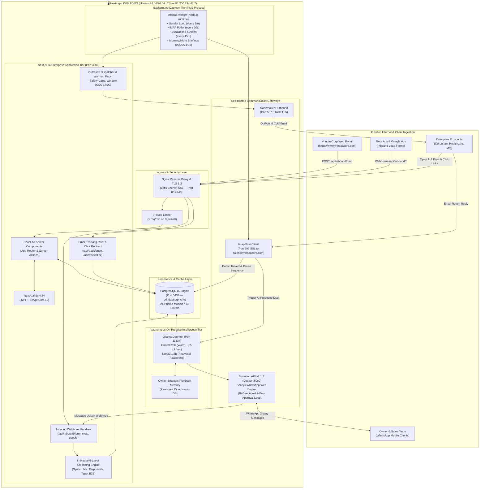
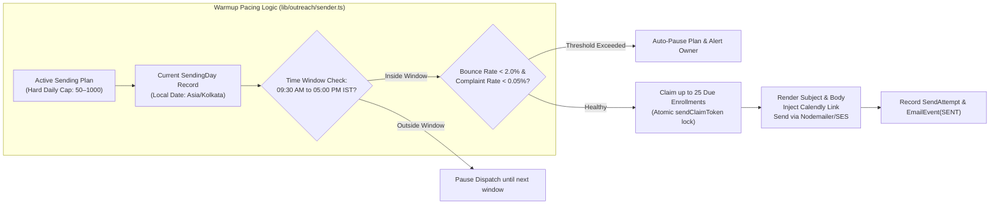
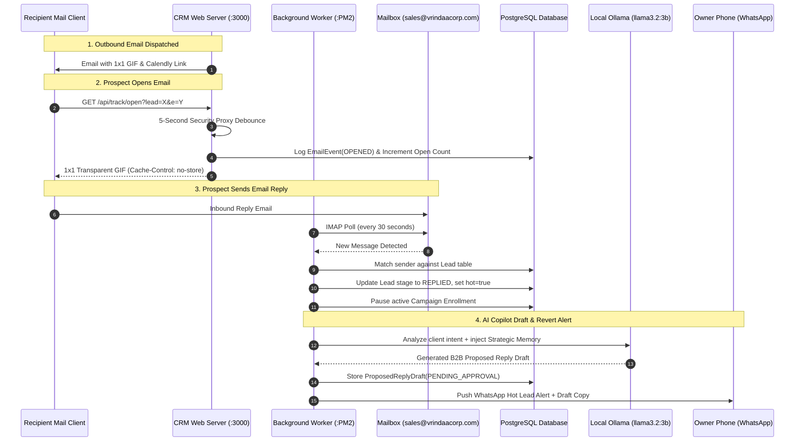

# 🏗️ VrindaaCorp Services — System Architecture & Technical Specifications
**Confidential & Proprietary • Engineering Handover Documentation**  
*System: VrindaaCorp Enterprise CRM & Autonomous AI Outreach Infrastructure*  
*Version: 1.0 (Production Release) • Handover Date: September 2026*

---

## 1. Architectural Overview & System Topology

The VrindaaCorp CRM is an enterprise-tier B2B Lead Lifecycle Management, Automated Cold Outreach, and Conversational AI platform. It is engineered with a **zero-external-API-cost philosophy**, hosting its application tier, relational database, on-premise Large Language Model (LLM), and WhatsApp communication gateway within a dedicated, high-performance Ubuntu Linux VPS.



---

## 2. Infrastructure & Hardware Specifications

The application runs on a dedicated high-spec virtual private server hosted in Hostinger's tier-3 datacenter in Mumbai, India:

| Specification Parameter | Technical Detail | Operational Impact |
| :--- | :--- | :--- |
| **Hosting Platform** | Hostinger KVM 8 Virtual Private Server | Dedicated kernel virtualization, guaranteed compute isolation |
| **Virtual CPUs** | **8 vCPU Cores** | High concurrency for Next.js SSR, multi-threaded Ollama CPU inference |
| **System Memory (RAM)** | **32 GB High-Speed RAM** | Ample headroom to keep `llama3.2:3b` resident in memory without swapping |
| **Storage Subsystem** | **400 GB NVMe SSD** | Ultra-low read/write latency (< 0.1ms I/O) for PostgreSQL ACID transactions |
| **Bandwidth Allocation** | **32 TB / Month** | Unlimited capacity for bulk email tracking, webhooks, and attachments |
| **Network IP** | `200.234.47.7` (Dedicated IPv4) | Clean IP allocation for high DNS and SMTP trust score |
| **Geographic Region** | India – Mumbai 2 | Ultra-low latency (< 15ms) across pan-India corporate hubs |
| **Operating System** | Ubuntu Linux 24.04 / 26.04 LTS | Enterprise stability, systemd process supervision, automated security patches |

---

## 3. Comprehensive Software Bill of Materials (SBOM)

### 3.1 Core Framework & Runtime Environment

| Package / Runtime | Exact Version | Architectural Role |
| :--- | :---: | :--- |
| **Node.js** | `>= 20.16.0 LTS` | Server-side JavaScript execution engine |
| **Next.js** | `14.2.35` | Full-stack web framework (React Server Components, Server Actions, Route Handlers) |
| **React & React DOM** | `18.3.1` | Concurrent client-side and server-rendered UI component tree |
| **TypeScript** | `5.6.2` | Compile-time strict type safety across all database queries and actions |
| **Prisma ORM** | `5.20.0` | Schema-driven Object-Relational Mapping with native type generation |
| **PostgreSQL** | `16.x` | Primary relational database engine |

### 3.2 Critical Production Dependencies

| Category | Dependency | Version | Purpose in VrindaaCorp CRM |
| :--- | :--- | :---: | :--- |
| **Authentication** | `next-auth` | `^4.24.8` | Session management, JWT encoding, cookie validation |
| | `bcryptjs` | `^2.4.3` | Salted hashing for passwords with constant-time dummy verify |
| **Email Inbound/Outbound** | `nodemailer` | `^7.0.13` | SMTP transport protocol implementation with MIME formatting |
| | `imapflow` | `^1.7.6` | High-performance IMAP client for 30-second mailbox polling |
| | `mailparser` | `^3.9.16` | RFC 822 email parser extracting text, HTML, and sender headers |
| | `@aws-sdk/client-ses` | `^3.658.0` | AWS Simple Email Service client (optional enterprise fallback) |
| | `@aws-sdk/client-sesv2` | `^3.658.0` | AWS SES v2 API integration for configuration set tracking |
| **Lead Validation** | `disposable-email-domains` | `^1.0.62` | Offline in-memory lookup table of 3,500+ burner/temporary email hosts |
| | Native `dns.promises` | Node Core | Real-time DNS MX record resolution against live nameservers |
| **Spreadsheet Processing** | `xlsx` (SheetJS) | `^0.18.5` | Parsing uploaded Excel files and generating multi-sheet `.xlsx` reports |
| | `papaparse` | `^5.4.1` | RFC 4180 compliant high-speed CSV parsing engine |
| **Security & Sanitization** | `isomorphic-dompurify` | `^3.22.0` | XSS sanitization of user-submitted HTML and AI-generated email copy |
| | `zod` | `^3.23.8` | Schema validation for API payloads, forms, and environment variables |
| **Data Visualization & UI** | `recharts` | `^2.12.7` | SVG-based responsive charting for delivery, open rate, and lead velocity |
| | `tailwindcss` | `^3.4.12` | Utility-first responsive styling with custom Slate/Teal palette |
| | `date-fns` | `^3.6.0` | Timezone-aware date calculations for warmup days and delays |
| **Process Management** | `pm2` | `^5.3.0` | Daemon process supervision, auto-clustering, crash resurrection |

---

## 4. Deep-Dive Subsystem Architecture

### 4.1 In-House 6-Layer Lead Cleansing & Validation Engine

Unlike legacy CRMs that require costly third-party verification credits (e.g., NeverBounce, ZeroBounce), VrindaaCorp CRM embeds a **zero-cost, multi-stage heuristic engine** executed natively on the VPS:

```mermaid
graph TD
    A[Raw Upload: CSV / Excel / Webform] --> B[Stage 1: Field Normalization]
    B --> C[E.164 Phone Formatting: +91 XXXXX XXXXX]
    B --> D[Geographic Hub Mapping: NCR, UP, Rajasthan]
    B --> E[Sector Canonicalization: Healthcare, Mfg, Corporate]
    
    E --> F[Stage 2: In-Batch & DB Deduplication]
    F -->|Duplicate Found| G[Mark Duplicate / Skip]
    F -->|Unique Lead| H[Stage 3: 6-Layer Email Verification]
    
    H --> I[Layer 1: RFC 5322 Syntax Regex]
    I -->|Invalid| J[Tag: INVALID / Reject]
    I -->|Pass| K[Layer 2: 3,500+ Disposable Blacklist]
    K -->|Disposable| L[Tag: DISPOSABLE / Suppress]
    K -->|Pass| M[Layer 3: Role-Based Account Check]
    M -->|info@, admin@, sales@| N[Tag: RISKY / Flag]
    M -->|Pass| O[Layer 4: Levenshtein Typo Corrector]
    O -->|gamil.com, yaho.com| P[Auto-Correct to gmail.com, yahoo.com]
    O -->|Pass| Q[Layer 5: Live DNS MX Mail Server Probe]
    Q -->|No MX Server| R[Tag: INVALID / Host Down]
    Q -->|Active MX Server| S[Layer 6: Corporate vs Webmail Classifier]
    S -->|tcs.com, infosys.com| T[Tag: VALID_CORPORATE]
    S -->|gmail.com, yahoo.com| U[Tag: VALID_WEBMAIL]
    
    T --> V[(Prisma Lead Table: Ready for Outreach)]
    U --> V
```

#### Detailed Layer Specifications:
1. **RFC 5322 Standard Check:** Validates structure (`local-part@domain`), rejects spaces, double dots, or invalid Unicode characters.
2. **Disposable / Burner Domain Blocklist:** Matches against `disposable-email-domains` containing 3,500+ known temporary domains (`mailinator.com`, `tempmail.com`, `yopmail.com`, `guerrillamail.com`).
3. **Role-Based Mailbox Detector:** Flags generic department addresses (`info@`, `support@`, `sales@`, `admin@`, `contact@`, `billing@`, `jobs@`) that hurt cold deliverability and risk spam complaints.
4. **Levenshtein Distance Typo Corrector:** Automatically detects single-character typographical errors on major providers (e.g., `gmai.com` &rarr; `gmail.com`, `outlok.com` &rarr; `outlook.com`, `hotmial.com` &rarr; `hotmail.com`).
5. **Real-Time DNS MX Verification:** Invokes native `dns.promises.resolveMx()` with a 3-second timeout to confirm that recipient mail exchange records exist. Results are cached in the `DomainReputation` table to eliminate repeated DNS queries.
6. **Corporate vs Webmail Classifier:** Differentiates high-value B2B enterprise domains from consumer webmail, enabling targeted segmentation in campaigns.

---

### 4.2 Autonomous Campaign Dispatcher & Warmup Pacer

To protect the primary domain (`vrindaacorp.com`) and ensure emails consistently reach corporate primary inboxes (avoiding Spam / Promotions tabs), outreach follows an algorithmic warmup pacing protocol:



#### Warmup Schedule Tiers:
- **Tier 1 (Days 1–7):** Max 50 emails/day | Single-lead spacing: 45–90 seconds jitter.
- **Tier 2 (Days 8–14):** Max 75 emails/day | Safety threshold: < 2.0% bounce rate.
- **Tier 3 (Days 15–21):** Max 100 emails/day | Monitored by the Bi-Weekly AI Domain Auditor.
- **Tier 4 (Days 22+):** Scaled incrementally up to the enterprise cap (1,000/day).

---

### 4.3 Real-Time Open Tracking & Inbound Reply Detection Pipeline

The CRM features a dedicated bidirectional engagement tracking loop:



#### Mathematical Precision in Open Tracking:
To prevent crawler anomalies from artificially inflating metrics:
$$\text{Unique Open Rate} = \left( \frac{\text{Count of Distinct Leads with at least 1 OPENED Event}}{\text{Count of Distinct Leads with at least 1 SENT Event}} \right) \times 100\%$$
- **Multi-Open Badging:** If a lead inspects an email repeatedly, the CRM renders **`OPENED (3x)`** or **`OPENED (4x)`** on the campaign dashboard to immediately highlight hot sales prospects.

---

### 4.4 On-Premise Ollama AI & Executive Strategic Memory Engine

The AI subsystem operates locally on the VPS without sending proprietary business data, pricing policies, or prospect correspondence to external third parties.

#### Architecture of the AI Layer:
1. **Local Model Hosting:** Ollama runs on port `11434`. The active model `llama3.2:3b` is optimized for CPU inference, generating **55.7 tokens/second** with **< 1.2-second response latency**.
2. **Deterministic Fast-Path Routing:** Standard executive commands (`"STATUS"`, `"METRICS"`, `"YES"`, `"CONFIRM"`, `"PAUSE"`, `"RESUME"`) bypass model generation entirely, executing deterministically in **< 15 milliseconds**.
3. **Owner Strategic Playbook Memory:** Stored in the `InboundLeadLog` table under `channel: "owner_strategic_memory"`.
   - Standing Directives are automatically injected into the system prompt of every email generator, campaign template refiner, and WhatsApp reply assistant.
   - **Mandatory Calendly Rule:** Enforces that every booking call-to-action strictly uses:
     ```text
     https://calendly.com/vrindaacorp-sales/30min
     ```
     Hallucinated placeholders (e.g., `[Insert Link]`, `example.com`) are strictly prohibited and scrubbed by post-processing filters.

---

### 4.5 Self-Hosted WhatsApp Co-Pilot Subsystem

The WhatsApp integration runs on **Evolution API v2.1.2** inside a lightweight Docker container, maintaining a persistent Baileys WebSocket session to WhatsApp Web.

#### Key Capabilities:
- **09:00 AM Morning Game Plan:** Pushes today's targeted send volume, sector allocations, and domain health status.
- **Real-Time Client Revert Alerts:** Instant notification within 30 seconds of an inbound prospect reply, accompanied by an AI-drafted response.
- **Conversational 1-Click Approval Loop:**
  - Replying `"YES"` or `"SEND"` immediately dispatches the proposed email from `sales@vrindaacorp.com`.
  - Replying with instructions (e.g., *"Make it shorter and offer a free cafeteria tasting session"*) prompts Ollama to regenerate version 2 and seek re-approval.
- **09:00 PM Day-End Briefing:** Summarizes daily sent volume, open rates, cumulative campaign reach, and flags repeat openers for immediate sales team follow-up.
- **Bi-Weekly Domain Scaling Audit (Every 14 Days):** Automatically reviews 14-day bounce and spam metrics, recommending safe tier escalations.

---

## 5. Inbound Lead Ingestion Pipelines

The CRM provides unified lead capture across three major external channels:

```
┌─────────────────────────────────┐
│  Public Corporate Web Portal    │
│  (https://www.vrindaacorp.com)  │
└────────────────┬────────────────┘
                 │ POST /api/inbound/form (Header: X-Form-Secret)
                 ▼
┌────────────────────────────────────────────────────────┐
│             CRM Inbound Routing Pipeline               │
│                                                        │
│ 1. Validate Shared Secret (INBOUND_FORM_SECRET)        │
│ 2. Audit Payload in InboundLeadLog                     │
│ 3. Execute 6-Layer Normalization & MX Validation       │
│ 4. Deduplicate against existing Leads                  │
│ 5. Create Lead record (stage: NEW, source: website)    │
│ 6. Auto-enroll into matching Sector Outreach Campaign  │
└────────────────────────────────────────────────────────┘
```

1. **Website Form Capture (`/api/inbound/form`):** Receives inquiries directly from the public corporate portal. Validates payload via `X-Form-Secret` or `?token=`.
2. **Meta / Facebook Lead Ads (`/api/inbound/meta`):** Supports `GET` challenge verification (`hub.verify_token`) and `POST` signed payload ingestion (`X-Hub-Signature-256`).
3. **Google Ads Lead Form Extensions (`/api/inbound/google`):** Parses Google Ads lead form webhooks verified via `GOOGLE_LEAD_KEY`.

---

## 6. Network Security, TLS Termination & Data Protection

### 6.1 Reverse Proxy & SSL Configuration
- **Nginx v1.24+** acts as the front-facing reverse proxy, binding ports `80` (HTTP) and `443` (HTTPS).
- HTTP traffic is forced to HTTPS via a `301 Permanent Redirect`.
- Modern TLS ciphers (`TLSv1.2` and `TLSv1.3`) are enforced with OCSP stapling and HSTS (`Strict-Transport-Security`).

### 6.2 Application Layer Defenses
- **Brute-Force Rate Limiting:** Custom IP-based token bucket in `middleware.ts` restricts login attempts to **5 attempts per minute per IP address**.
- **Timing-Attack Resistance:** NextAuth credentials provider compares unknown email submissions against a pre-computed dummy bcrypt hash (cost: 12), ensuring constant response time (~150ms) to prevent email enumeration.
- **SQL Injection Prevention:** 100% of database interactions utilize Prisma ORM's strongly typed, parameterized SQL queries. Raw SQL string concatenation is strictly prohibited.
- **XSS Sanitization:** All HTML template copies and inbound email preview snippets pass through `isomorphic-dompurify` before rendering in the DOM.

---
*End of Architecture Diagram & Technical Specifications.*
