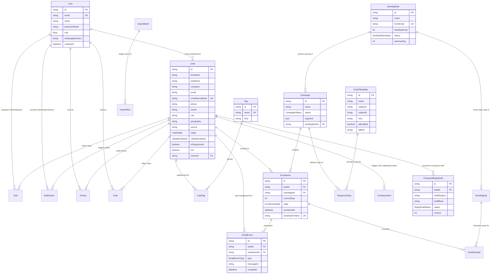

# 🗄️ VrindaaCorp Services — Database ERD & Complete Data Dictionary
**Confidential & Proprietary • Engineering Architecture Reference**  
*System: VrindaaCorp Enterprise CRM & Autonomous Outreach Infrastructure*  
*Database Engine: PostgreSQL 16.x • ORM: Prisma 5.20.0 • Schema: public*  
*Version: 1.0 (Production Release) • Handover Date: September 2026*

---

## 1. Architectural Overview & Design Principles

The VrindaaCorp CRM database is engineered to handle high-concurrency lead lifecycle tracking, automated campaign sequence execution, real-time email engagement metrics, and AI-driven conversational approvals.

### Key Database Characteristics:
- **ACID Compliance:** Guaranteed transactional safety across batch email enrollments, deduplication runs, and status mutations.
- **Relational Integrity:** Explicit foreign key constraints with appropriate `ON DELETE CASCADE` or `ON DELETE SET NULL` cascades to prevent orphaned child records.
- **Normalized Query Optimization:** Composite B-tree indexes applied on high-cardinality filters (`emailNormalized`, `stage`, `sector`, `geography`, `ownerId`, and time-series send timestamps).
- **Scalability:** 24 models and 13 enumerated types supporting millions of lead interaction events with zero schema drift.

---

## 2. Complete Entity-Relationship Diagram (ERD)

---

## 3. Enumerated Types Reference (Enums)

| Enum Identifier | Declared Values | Functional Purpose in System |
| :--- | :--- | :--- |
| **`Role`** | `ADMIN`, `OWNER`, `AGENT` | Role-based access control governing CRM navigation, user management, and campaign controls. |
| **`LeadStage`** | `NEW`, `CONTACTED`, `REPLIED`, `QUALIFIED`, `PROPOSAL_SENT`, `WON`, `LOST` | 7-stage sales pipeline tracking a prospect from cold outreach to signed deal. |
| **`ValidationStatus`** | `UNKNOWN`, `VALID`, `INVALID`, `RISKY`, `DISPOSABLE`, `CATCH_ALL` | Result of the 6-layer in-house email verification engine. |
| **`ContractStatus`** | `UNKNOWN`, `NONE`, `ACTIVE` | Incumbent facility vendor contract tracking. |
| **`ImportStatus`** | `PENDING`, `MAPPED`, `PROCESSING`, `COMPLETED`, `FAILED` | Staging status for bulk CSV/Excel lead imports. |
| **`CampaignStatus`** | `DRAFT`, `ACTIVE`, `PAUSED`, `COMPLETED` | Execution state of an outreach campaign. |
| **`SendingPlanStatus`**| `DRAFT`, `ACTIVE`, `PAUSED`, `COMPLETED` | Operational status of the domain warmup plan. |
| **`SendAttemptStatus`** | `PENDING`, `SENT`, `FAILED`, `UNKNOWN` | Result of an individual email transmission attempt. |
| **`EnrollmentState`** | `ACTIVE`, `PAUSED`, `COMPLETED` | Status of a specific lead progressing through sequence steps. |
| **`EmailEventType`** | `SENT`, `DELIVERED`, `OPENED`, `CLICKED`, `REPLIED`, `BOUNCED`, `COMPLAINED`, `UNSUBSCRIBED` | Audit log for tracking pixels, clicks, and mailbox replies. |
| **`SuppressionReason`**| `HARD_BOUNCE`, `COMPLAINT`, `UNSUBSCRIBE`, `MANUAL` | Reason an email address is permanently barred from outreach. |
| **`NotificationState`**| `SENT`, `ACKNOWLEDGED`, `ESCALATED` | State of an owner notification alert. |
| **`ReplyDraftStatus`** | `PENDING_APPROVAL`, `APPROVED`, `REVISED`, `SENT`, `REJECTED` | WhatsApp approval status of an AI-generated revert draft. |

---

## 4. Complete Data Dictionary (All 24 Models)

### 4.1 `User` (Authentication & Team Members)
Stores credentials, access roles, and notification phone numbers for sales and administrative staff.

| Column | Type | Nullable | Default | Constraints | Description |
| :--- | :--- | :---: | :---: | :---: | :--- |
| `id` | `TEXT` | No | `cuid()` | **PK** | Unique record identifier |
| `email` | `TEXT` | No | — | **UNIQUE** | Corporate email address (login credential) |
| `name` | `TEXT` | Yes | — | — | Full display name |
| `passwordHash` | `TEXT` | No | — | — | Bcrypt hashed password (salt cost: 12) |
| `role` | `Role` | No | `AGENT` | — | Access role: `ADMIN`, `OWNER`, `AGENT` |
| `whatsappNumber` | `TEXT` | Yes | — | — | E.164 phone number for WhatsApp alerts (`+91...`) |
| `createdAt` | `TIMESTAMP` | No | `now()` | — | Account creation timestamp |
| `updatedAt` | `TIMESTAMP` | No | — | — | Last account update timestamp |

---

### 4.2 `Lead` (Primary Prospect Data Store)
The central entity representing corporate prospects across target sectors.

| Column | Type | Nullable | Default | Constraints | Description |
| :--- | :--- | :---: | :---: | :---: | :--- |
| `id` | `TEXT` | No | `cuid()` | **PK** | Unique lead identifier |
| `firstName` | `TEXT` | Yes | — | — | Contact first name |
| `lastName` | `TEXT` | Yes | — | — | Contact last name |
| `company` | `TEXT` | Yes | — | — | Company / Enterprise name |
| `email` | `TEXT` | No | — | — | Contact email address |
| `emailNormalized` | `TEXT` | No | — | **INDEX** | Lowercased/trimmed email for dedup & suppression |
| `phone` | `TEXT` | Yes | — | — | Phone number formatted in E.164 standard |
| `sector` | `TEXT` | Yes | — | **INDEX** | Target sector: `Corporate`, `Healthcare`, `Industrial`, etc. |
| `city` | `TEXT` | Yes | — | — | Normalized city (e.g., `Gurgaon`, `Noida`, `Lucknow`) |
| `geography` | `TEXT` | Yes | — | **INDEX** | Regional hub: `NCR`, `UP`, `pan-India` |
| `source` | `TEXT` | Yes | — | — | Source channel: `website_form`, `meta_ads`, `import` |
| `sourceDetail` | `TEXT` | Yes | — | — | Form ID, campaign ID, or CSV filename |
| `stage` | `LeadStage` | No | `NEW` | **INDEX** | Sales pipeline stage |
| `validationStatus`| `ValidationStatus`| No | `UNKNOWN`| — | Result of 6-layer cleansing engine |
| `validationReason`| `TEXT` | Yes | — | — | Human-readable explanation (e.g., `Disposable domain`) |
| `validationCheckedAt`| `TIMESTAMP` | Yes | — | — | Timestamp of last validation run |
| `smtpCheckedAt` | `TIMESTAMP` | Yes | — | **INDEX** | Timestamp of live DNS/SMTP MX probe |
| `isSuppressed` | `BOOLEAN` | No | `false` | — | True if unsubscribed, bounced, or suppressed |
| `hot` | `BOOLEAN` | No | `false` | — | True if prospect replied or engaged multiple times |
| `ownerId` | `TEXT` | Yes | — | **FK &rarr; User(id)** | Assigned sales representative |
| `contractStatus` | `ContractStatus` | No | `UNKNOWN`| — | Incumbent vendor contract status |
| `incumbentVendor` | `TEXT` | Yes | — | — | Name of current facility vendor if known |
| `contractExpiry` | `TIMESTAMP` | Yes | — | **INDEX** | Expiration date of incumbent contract |
| `contractConfidence`| `TEXT` | Yes | — | — | AI confidence level (`low`, `medium`, `high`) |
| `contractSource` | `TEXT` | Yes | — | — | Source: `ai`, `manual`, `import` |
| `contractCheckedAt` | `TIMESTAMP` | Yes | — | **INDEX** | Timestamp of contract intelligence check |
| `contractConfirmed`| `BOOLEAN` | No | `false` | — | Verified by human sales agent |
| `contractReminderSentAt`| `TIMESTAMP` | Yes | — | — | 30-day renewal reminder timestamp |
| `createdAt` | `TIMESTAMP` | No | `now()` | — | Timestamp of creation |
| `updatedAt` | `TIMESTAMP` | No | — | — | Timestamp of last modification |

---

### 4.3 `DomainReputation` (DNS & Catch-All Cache)
Caches domain-level MX and catch-all results to prevent redundant DNS queries across identical company domains.

| Column | Type | Nullable | Default | Constraints | Description |
| :--- | :--- | :---: | :---: | :---: | :--- |
| `domain` | `TEXT` | No | — | **PK** | Domain name (e.g., `infosys.com`) |
| `isCatchAll` | `BOOLEAN` | No | `false` | — | True if domain accepts all inbound mailboxes |
| `mxHost` | `TEXT` | Yes | — | — | Primary Mail Exchange (MX) hostname |
| `lastCheckedAt` | `TIMESTAMP` | No | `now()` | — | Cache timestamp |

---

### 4.4 `Tag` & `LeadTag` (Flexible Multi-Tagging)
Manages many-to-many tag relationships (e.g., sectors, priority tiers, campaign buckets).

| Model | Column | Type | Constraints | Description |
| :--- | :--- | :--- | :---: | :--- |
| **`Tag`** | `id` | `TEXT` | **PK** | Unique tag ID |
| | `name` | `TEXT` | **UNIQUE** | Tag name (e.g., `Healthcare`, `NCR`, `Hot-Lead`) |
| | `kind` | `TEXT` | Default: `general`| Category: `sector`, `geography`, `priority`, `campaign` |
| **`LeadTag`** | `leadId` | `TEXT` | **PK, FK &rarr; Lead(id)** | Associated lead (Cascade on delete) |
| | `tagId` | `TEXT` | **PK, FK &rarr; Tag(id)** | Associated tag (Cascade on delete) |

---

### 4.5 `ImportBatch` & `ImportRow` (Spreadsheet Staging)
Provides resilient 2-phase staging for CSV/Excel file uploads.

| Model | Column | Type | Constraints | Description |
| :--- | :--- | :--- | :---: | :--- |
| **`ImportBatch`** | `id` | `TEXT` | **PK** | Unique batch identifier |
| | `filename` | `TEXT` | — | Uploaded spreadsheet name |
| | `status` | `ImportStatus` | Default: `PENDING` | `PENDING`, `MAPPED`, `PROCESSING`, `COMPLETED` |
| | `columnMapping`| `JSONB` | — | Column map `{ email: "Work Email", company: "Org" }` |
| | `totalRows` | `INT` | Default: `0` | Total records in file |
| | `importedRows`| `INT` | Default: `0` | Successfully validated & imported records |
| | `duplicateRows`| `INT` | Default: `0` | Duplicate records skipped |
| | `invalidRows` | `INT` | Default: `0` | Malformed records rejected |
| **`ImportRow`** | `id` | `TEXT` | **PK** | Unique row identifier |
| | `batchId` | `TEXT` | **FK &rarr; ImportBatch(id)** | Parent batch ID |
| | `raw` | `JSONB` | — | Raw JSON row before transformation |
| | `status` | `TEXT` | Default: `pending` | `pending`, `imported`, `duplicate`, `invalid` |
| | `note` | `TEXT` | — | Processing note or validation failure reason |

---

### 4.6 `SendingPlan` & `SendingDay` (Outreach Warmup Engine)
Enforces mathematical domain warmup curves, daily caps, and automated safety stops.

| Model | Column | Type | Constraints | Description |
| :--- | :--- | :--- | :---: | :--- |
| **`SendingPlan`** | `id` | `TEXT` | **PK** | Unique sending plan identifier |
| | `name` | `TEXT` | — | Plan name (e.g., `Sales Primary Warmup`) |
| | `fromEmail` | `TEXT` | **UNIQUE** | Outbound sender address (`sales@vrindaacorp.com`) |
| | `fromDomain` | `TEXT` | **INDEX** | Outbound domain (`vrindaacorp.com`) |
| | `timezone` | `TEXT` | Default: `Asia/Kolkata`| Operational business timezone |
| | `sendWindowStart`| `TEXT`| Default: `09:00` | Start of daily dispatch window (IST) |
| | `sendWindowEnd` | `TEXT` | Default: `18:00` | End of daily dispatch window (IST) |
| | `hardDailyCap` | `INT` | Default: `1000` | Maximum absolute ceiling |
| | `status` | `SendingPlanStatus` | Default: `DRAFT` | `DRAFT`, `ACTIVE`, `PAUSED`, `COMPLETED` |
| | `warmupDay` | `INT` | Default: `1` | Current day in the warmup schedule |
| | `schedule` | `JSONB` | — | Array of daily allowed limits by warmup day |
| | `bounceStopRate`| `FLOAT`| Default: `0.05` | Auto-pause threshold (5% bounce rate) |
| **`SendingDay`** | `id` | `TEXT` | **PK** | Unique record identifier |
| | `planId` | `TEXT` | **FK &rarr; SendingPlan(id)** | Associated sending plan |
| | `localDate` | `DATE` | **INDEX** | Calendar day in target timezone |
| | `allowed` | `INT` | — | Max emails permitted today |
| | `reserved` | `INT` | Default: `0` | Emails claimed by worker |
| | `sent` | `INT` | Default: `0` | Emails successfully dispatched |
| | `failed` | `INT` | Default: `0` | Email dispatch errors |
| | `bounced` | `INT` | Default: `0` | Bounces recorded |
| | `complained`| `INT` | Default: `0` | Spam complaints recorded |

---

### 4.7 `Campaign`, `EmailTemplate` & `SequenceStep` (Sequence Builder)
Manages multi-step automated email workflows with dynamic sector copy injection.

| Model | Column | Type | Constraints | Description |
| :--- | :--- | :--- | :---: | :--- |
| **`Campaign`** | `id` | `TEXT` | **PK** | Unique campaign identifier |
| | `name` | `TEXT` | — | Campaign title |
| | `status` | `CampaignStatus` | Default: `DRAFT` | `DRAFT`, `ACTIVE`, `PAUSED`, `COMPLETED` |
| | `segment` | `JSONB` | — | Filter JSON `{ sector, geography, tags }` |
| | `sendingPlanId`| `TEXT` | **FK &rarr; SendingPlan(id)** | Bound domain warmup plan |
| **`EmailTemplate`**| `id` | `TEXT` | **PK** | Unique template identifier |
| | `name` | `TEXT` | — | Template display name |
| | `subjectA` | `TEXT` | — | Primary email subject line |
| | `subjectB` | `TEXT` | — | Optional A/B test variant subject line |
| | `html` | `TEXT` | — | HTML body copy with tokens (`{{firstName}}`, etc.) |
| | `aiEnabled` | `BOOLEAN` | Default: `false` | Enable per-lead dynamic LLM personalization |
| | `aiBrief` | `TEXT` | — | Specific value proposition instructions for the AI |
| **`SequenceStep`** | `id` | `TEXT` | **PK** | Unique step identifier |
| | `campaignId` | `TEXT` | **FK &rarr; Campaign(id)** | Parent campaign |
| | `templateId` | `TEXT` | **FK &rarr; EmailTemplate(id)**| Associated template copy |
| | `order` | `INT` | — | Step position (`0` = Initial, `1` = Follow-up 1) |
| | `delayDays` | `INT` | — | Delay days after preceding step (`0`, `3`, `6`) |

---

### 4.8 `Enrollment` & `SendAttempt` (Lead Sequence Execution)
Tracks the exact progression of a lead through sequence steps.

| Model | Column | Type | Constraints | Description |
| :--- | :--- | :--- | :---: | :--- |
| **`Enrollment`** | `id` | `TEXT` | **PK** | Unique enrollment identifier |
| | `leadId` | `TEXT` | **FK &rarr; Lead(id)** | Enrolled prospect |
| | `campaignId` | `TEXT` | **FK &rarr; Campaign(id)** | Active campaign |
| | `currentStep` | `INT` | Default: `0` | Index of sequence step to execute |
| | `state` | `EnrollmentState` | Default: `ACTIVE` | `ACTIVE`, `PAUSED`, `COMPLETED` |
| | `pausedReason` | `TEXT` | — | Reason: `replied`, `unsubscribed`, `bounced` |
| | `nextSendAt` | `TIMESTAMP` | **INDEX** | Next scheduled dispatch datetime |
| | `sendClaimToken`| `TEXT` | **UNIQUE** | Distributed atomic lock token preventing double sends |
| | `sendClaimedUntil`| `TIMESTAMP` | **INDEX** | Lock expiration timestamp (5-minute lease) |
| **`SendAttempt`** | `id` | `TEXT` | **PK** | Unique attempt identifier |
| | `enrollmentId` | `TEXT` | **FK &rarr; Enrollment(id)** | Associated enrollment |
| | `stepOrder` | `INT` | — | Step index attempted |
| | `attemptNumber`| `INT` | — | Retry attempt count |
| | `status` | `SendAttemptStatus` | Default: `PENDING` | `PENDING`, `SENT`, `FAILED`, `UNKNOWN` |
| | `providerId` | `TEXT` | — | SMTP messageId or SES provider ID |
| | `error` | `TEXT` | — | Detailed transmission error message if failed |

---

### 4.9 `EmailEvent` & `Suppression` (Tracking & Compliance)
Maintains 100% auditability of deliverability, opens, link clicks, replies, and unsubscribes.

| Model | Column | Type | Constraints | Description |
| :--- | :--- | :--- | :---: | :--- |
| **`EmailEvent`** | `id` | `TEXT` | **PK** | Unique event identifier |
| | `leadId` | `TEXT` | **FK &rarr; Lead(id)** | Associated prospect |
| | `enrollmentId` | `TEXT` | **FK &rarr; Enrollment(id)** | Associated campaign enrollment |
| | `type` | `EmailEventType` | **INDEX** | `SENT`, `OPENED`, `CLICKED`, `REPLIED`, `BOUNCED` |
| | `messageId` | `TEXT` | **INDEX** | Correlating message identifier |
| | `subjectVariant`| `TEXT` | — | Variant tracked: `"A"` or `"B"` |
| | `metadata` | `JSONB` | — | Request IP, user agent, or clicked URL |
| | `createdAt` | `TIMESTAMP` | **INDEX** | Event timestamp |
| **`Suppression`**| `id` | `TEXT` | **PK** | Unique suppression ID |
| | `emailNormalized`| `TEXT` | **UNIQUE** | Suppressed email address |
| | `reason` | `SuppressionReason`| — | `HARD_BOUNCE`, `COMPLAINT`, `UNSUBSCRIBE` |
| | `createdAt` | `TIMESTAMP` | — | Timestamp of suppression |

---

### 4.10 `Activity`, `Note` & `Task` (CRM Operational Tools)
Provides sales agents with customer timeline history, internal notes, and follow-up tasks.

| Model | Primary Columns | Key Foreign Keys | Purpose |
| :--- | :--- | :--- | :--- |
| **`Activity`** | `id`, `type`, `message`, `createdAt` | `leadId` &rarr; `Lead`, `userId` &rarr; `User` | Audit log of stage shifts, calls, and emails |
| **`Note`** | `id`, `body`, `createdAt` | `leadId` &rarr; `Lead`, `userId` &rarr; `User` | Internal sales team notes on lead profile |
| **`Task`** | `id`, `title`, `dueAt`, `completed` | `leadId` &rarr; `Lead`, `assigneeId` &rarr; `User` | Action item (e.g., *"Send commercial proposal"*) |

---

### 4.11 `Notification`, `CompanyAlert` & `JobRun` (Alerts & Supervision)
Drives the 48-hour owner escalation pipeline and background worker health monitoring.

| Model | Primary Columns | Key Foreign Keys | Purpose |
| :--- | :--- | :--- | :--- |
| **`Notification`** | `id`, `channels`, `state`, `context`, `acknowledgedAt`, `escalatedAt` | `leadId` &rarr; `Lead`, `ownerId` &rarr; `User` | Hot lead notification & 48h owner escalation |
| **`CompanyAlert`** | `id`, `kind`, `sentAt` | `leadId` &rarr; `Lead` | 24h unattended lead reminder to shared corporate inbox |
| **`JobRun`** | `id`, `job`, `startedAt`, `finishedAt`, `ok`, `detail` | — | Heartbeat and diagnostic logs for PM2 worker tasks |

---

### 4.12 `InboundLeadLog` & `ProposedReplyDraft` (AI & Inbound Audit)
Stores external inbound webhook audit trails, persistent Owner Strategic Memory directives, and WhatsApp reply drafts.

| Model | Column | Type | Constraints | Description |
| :--- | :--- | :--- | :---: | :--- |
| **`InboundLeadLog`** | `id` | `TEXT` | **PK** | Unique record identifier |
| | `channel` | `TEXT` | **INDEX** | Channel: `website_form`, `meta_ads`, `owner_strategic_memory` |
| | `status` | `TEXT` | — | Ingestion status: `received`, `created`, `duplicate`, `active` |
| | `payload` | `JSONB` | — | Complete raw request payload / Strategic Memory playbook |
| | `leadId` | `TEXT` | — | Resulting Lead ID if created |
| | `note` | `TEXT` | — | Diagnostic parsing note |
| **`ProposedReplyDraft`**| `id` | `TEXT` | **PK** | Unique draft identifier |
| | `leadId` | `TEXT` | **FK &rarr; Lead(id)** | Associated prospect who replied |
| | `inboundSubject` | `TEXT` | — | Subject line of incoming prospect email |
| | `inboundBody` | `TEXT` | — | Body text of incoming prospect email |
| | `draftSubject` | `TEXT` | — | AI-generated reply subject line |
| | `draftBody` | `TEXT` | — | AI-generated reply body (enforcing Calendly link) |
| | `status` | `ReplyDraftStatus` | Default: `PENDING_APPROVAL` | `PENDING_APPROVAL`, `APPROVED`, `REVISED`, `SENT` |
| | `agentPhone` | `TEXT` | **INDEX** | WhatsApp recipient phone number |
| | `version` | `INT` | Default: `1` | Revision version number |
| | `revisionNotes` | `TEXT` | — | Owner feedback provided via WhatsApp chat |

---
*End of Database ERD & Data Dictionary.*
