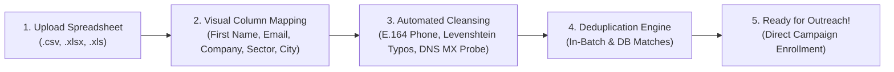

# 📘 VrindaaCorp Services — CRM Administrator & Operations Guide
**Comprehensive Operational Manual • Enterprise Production Edition**  
*System: VrindaaCorp Enterprise CRM & Autonomous Outreach Infrastructure*  
*Portal URL: [https://vrindaacorp-crm.tech](https://vrindaacorp-crm.tech)*  
*Version: 1.0 (Production Release) • Handover Date: September 2026*

---

## 1. Executive Introduction & System Vision

Welcome to **VrindaaCorp CRM**, the enterprise-grade Lead Management, Multi-Channel Campaign Outreach, and Autonomous Intelligence platform designed specifically for **VrindaaCorp Services**.

As an integrated facility management, hard services (HVAC, electrical, plumbing), housekeeping, 24/7 security, and corporate catering provider operating across **Delhi-NCR, Greater Noida West, Uttar Pradesh, and pan-India**, VrindaaCorp requires a unified platform to:
1. **Centralize Corporate Prospect Intelligence:** Maintain verified records for facilities managers, administrative heads, and procurement directors.
2. **Automate Sector-Specific Outreach:** Deliver tailored, high-converting B2B emails to Corporate Offices, Healthcare Facilities, Manufacturing Plants, Educational Institutions, and Industrial Parks.
3. **Protect Sender Domain Reputation:** Implement strict mathematical warmup pacing and in-house email validation to guarantee primary inbox delivery.
4. **Empower Executive Leadership via WhatsApp:** Alert the Owner and Sales Directors within 30 seconds of client replies, providing AI-drafted responses for instant one-click approval.

---

## 2. Accessing the CRM & User Authentication

### 2.1 Portal Login
1. Open any modern desktop or mobile browser and navigate to:
   ```text
   https://vrindaacorp-crm.tech/login
   ```
2. Enter your authorized corporate email and password:
   - **Default Admin Account:** `admin@vrindaacorp.com`
   - **Initial Seed Password:** `admin123`
3. Click **Sign In**.

> [!TIP]
> After logging in for the first time, navigate to **Account Settings** in the lower-left sidebar to update your password and configure your WhatsApp phone number.

### 2.2 Security & Rate Limiting Notice
The CRM login endpoint enforces an automated rate limiter (**maximum 5 attempts per minute per IP address**). If multiple incorrect passwords are submitted, access will be temporarily throttled for 60 seconds to protect against brute-force attacks.

---

## 3. Mission Control: Dashboard & Executive Analytics

The **Dashboard** (`/`) is your operational mission control, aggregating real-time metrics across all lead sources and outreach sequences:

```
┌─────────────────┐ ┌─────────────────┐ ┌─────────────────┐ ┌─────────────────┐
│   Total Leads   │ │  Emails Sent    │ │ Unique Open Rate│ │ Inbound Replies │
│     1,196       │ │      482        │ │     38.4%       │ │       19        │
│ 100% Validated  │ │ Today: 48 / 50  │ │  185 Readers    │ │   100% Caught   │
└─────────────────┘ └─────────────────┘ └─────────────────┘ └─────────────────┘
```

### Key KPI Definitions:
- **Total Leads:** Total deduplicated corporate prospects stored in the CRM database.
- **Emails Sent Today:** Number of outreach emails dispatched during today's safety window (09:30 AM – 05:00 PM IST) vs. current daily cap.
- **Unique Open Rate:** The true engagement percentage:
  $$\text{Open Rate} = \frac{\text{Distinct Leads Who Opened}}{\text{Distinct Leads Sent}} \times 100\%$$
- **Inbound Replies:** Total client responses captured by the 30-second IMAP poller.

### Multi-Filter Toolbar
Filter the dashboard view and all metric graphs using the global toolbar:
- **Timeframe:** `Today`, `Last 7 Days`, `Last 30 Days`, `Quarter-to-Date`, `Year-to-Date`, `All Time`.
- **Target Sector:** `Corporate`, `Healthcare`, `Industrial`, `Education`, `Hospitality`, `Retail`.
- **Regional Hub:** `NCR (Delhi, Gurgaon, Noida)`, `UP (Lucknow, Kanpur)`, `pan-India`.
- **Lead Owner:** View metrics for specific sales representatives.

### Exporting Executive Excel Reports
Click the **Export Report** button in the upper-right corner. The CRM dynamically generates a multi-sheet `.xlsx` workbook containing:
1. `Executive Summary` (High-level KPIs and filter criteria).
2. `Outreach Velocity` (Daily send, open, click, and reply counts).
3. `Pipeline Distribution` (Lead counts and conversion rates by stage).
4. `Filtered Leads Table` (Full contact details for offline review).

---

## 4. Managing Leads & Customer Folders

The **Leads** view (`/leads`) functions as your digital rolodex with comprehensive search, filtering, and bulk action capabilities.

### 4.1 Understanding Verification Badges
Every lead uploaded or captured is evaluated by the in-house 6-layer verification engine:

| Status Badge | Color | Meaning & Safety Recommendation |
| :--- | :---: | :--- |
| **`VALID (Corporate)`** | 🟢 Green | Verified B2B enterprise email (`@tcs.com`, `@maxhealthcare.com`). 100% safe for outreach. |
| **`VALID (Webmail)`** | 🔵 Blue | Verified active consumer address (`@gmail.com`, `@yahoo.com`). Safe to email. |
| **`RISKY`** | 🟡 Yellow | Role-based inbox (`info@`, `admin@`, `sales@`, `support@`). Can be emailed with caution. |
| **`INVALID`** | 🔴 Red | Syntax error or domain has no active DNS MX mail servers. Automatically suppressed. |
| **`DISPOSABLE`** | ⚫ Gray | Temporary/burner domain (`mailinator.com`, `tempmail.com`). Automatically blocked. |

### 4.2 Inside the Lead Customer Folder
Click any lead's name to open their profile (`/leads/[id]`):
- **Overview Header:** Stage dropdown, contact info, owner assignment, and `Hot Lead` toggle.
- **Contract Intelligence Card:** Track incumbent facility vendor name, contract expiration date, and automated 30-day renewal reminders.
- **Activity Timeline:** Complete chronological history of emails sent, opens recorded, replies received, and stage progressions.
- **Internal Sales Notes:** Add private notes regarding client site visits, RFPs, or cafeteria headcount requirements.
- **Follow-Up Tasks:** Assign actionable tasks with due dates to team members.

---

## 5. In-House Lead Import & Cleansing Guide

The CRM features a **zero-external-cost, 100% in-house spreadsheet import engine** located at `/import`.



### Step-by-Step Import Instructions:
1. Navigate to **Import & Cleanup** (`/import`) in the sidebar.
2. Drag and drop your `.csv` or `.xlsx` spreadsheet into the upload zone.
3. **Map Your Columns:** The CRM will inspect your header row and auto-suggest matches:
   - `First Name` &rarr; Contact's first name
   - `Company` &rarr; Enterprise / facility name
   - `Email` &rarr; Work email address (Mandatory)
   - `Phone` &rarr; Mobile / landline (Auto-formatted to `+91 XXXXX XXXXX`)
   - `Sector` &rarr; Industry (`Corporate`, `Healthcare`, `Industrial`, etc.)
   - `City` &rarr; Facility location (`Gurgaon`, `Noida`, `Greater Noida`, etc.)
4. Click **Process & Cleanse Leads**.
5. The system will process records in the background, validating DNS MX records and auto-correcting common domain typos (e.g., `gamil.com` &rarr; `gmail.com`).
6. Upon completion, a summary modal displays total rows imported, duplicates skipped, and invalid records suppressed.

---

## 6. The Visual Sales Pipeline (Kanban Board)

The **Pipeline** view (`/pipeline`) provides a visual Kanban board displaying your deals across 7 standard stages:

```
┌──────────────┐ ┌──────────────┐ ┌──────────────┐ ┌──────────────┐ ┌──────────────┐
│     NEW      │ │  CONTACTED   │ │   REPLIED    │ │  QUALIFIED   │ │PROPOSAL SENT │
│   (1,113)    │ │     (48)     │ │     (19)     │ │     (8)      │ │     (5)      │
│ Unreached    │ │ Email Sent   │ │ Hot Reverts  │ │ Site Audit   │ │ Commercial   │
└──────────────┘ └──────────────┘ └──────────────┘ └──────────────┘ └──────────────┘
```

### Pipeline Progression Rules:
- **Auto-Progression to `CONTACTED`:** The moment the campaign worker dispatches the initial outreach email, the lead automatically shifts from `NEW` to `CONTACTED`.
- **Auto-Progression to `REPLIED` (🔥 Hot Lead):** When an inbound reply is detected via IMAP, the lead moves to `REPLIED`, active cold sequences are paused, and a WhatsApp alert is dispatched.
- **Manual Drag-and-Drop:** Drag deal cards into `QUALIFIED`, `PROPOSAL_SENT`, `WON`, or `LOST` as negotiations advance.

---

## 7. Campaign Sequence Builder & Automated Outreach

The **Campaigns** section (`/campaigns`) manages automated multi-step email sequences designed to run continuously on autopilot.

### 7.1 Creating a Targeted Campaign
1. Click **+ Create Campaign**.
2. Give the campaign a descriptive title (e.g., `Batch 1 - Healthcare Facilities NCR`).
3. Select your **Target Segment Filters**:
   - Filter by Sector: `Healthcare`
   - Filter by Region: `NCR`
   - Filter by Validation Status: `VALID`
4. The CRM displays the real-time matching lead count.

### 7.2 Building Sequence Steps
A campaign consists of multiple sequential emails separated by day delays:
- **Step 1 (Delay: 0 Days):** Initial value-driven introductory outreach.
- **Step 2 (Delay: 3 Days):** Gentle follow-up referencing specific sector pain points.
- **Step 3 (Delay: 6 Days):** Final consultative check-in proposing a brief discovery call.

### 7.3 Manual Dispatch vs Scheduled Pacing
- **⚡ Trigger Outreach Now:** Opens the execution modal to immediately dispatch due emails. Allows overriding the standard business hours window for urgent testing.
- **Schedule Outreach:** Schedule a send for a specific future window (e.g., *"Tomorrow at 09:30 AM IST"*).
- **Automated Background Pacing:** The background worker (`vrindaa-worker`) automatically checks every 5 minutes during the active window (`09:30 AM – 05:00 PM IST`) and claims up to 25 leads per run, adhering strictly to the daily sending cap.

---

## 8. Campaign Template Editor & AI Refinement

Click **Edit / Refine with AI** on any sequence step to open the full-screen **Template Studio**:

### 8.1 HTML Copy Editor & Merge Tokens
Use standard HTML tags (`<p>`, `<strong>`, `<em>`, `<ul>`, `<li>`, `<a>`) with dynamic curly-brace tokens:
- `{{firstName}}` &rarr; Prospect's first name (defaults to *"there"*)
- `{{company}}` &rarr; Enterprise name (defaults to *"your organization"*)
- `{{city}}` &rarr; Facility city (e.g., *"Gurgaon"*)
- `{{geography}}` &rarr; Regional hub (e.g., *"Delhi-NCR"*)
- `{{industryHook}}` &rarr; Tailored value proposition for the lead's sector

### 8.2 Strict Calendly Booking Link Enforcement
The CRM enforces strict compliance with VrindaaCorp's official scheduling link:
```text
https://calendly.com/vrindaacorp-sales/30min
```
- **One-Click Insert Button:** Click the green **`📅 + Book a Call Link`** button in the token toolbar to instantly inject:
  ```html
  <p><a href="https://calendly.com/vrindaacorp-sales/30min">Book a 30-min call</a></p>
  ```
- **Quick Suggestion Pill:** Click **`📅 Add Calendly Booking Link`** to have Ollama craft a polished call-to-action inviting the recipient to schedule a discussion.

### 8.3 Live Lead Preview
Switch to the **Live Lead Preview** tab to render the exact email as it will appear to real prospects from your database, validating all token replacements and clickable hyperlinks.

---

## 9. WhatsApp Autonomous AI Co-Pilot

The WhatsApp Co-Pilot runs autonomously on your VPS, turning the Owner's mobile phone into an executive command station.

### 9.1 Initial Device Pairing via QR Code
1. Navigate to **Settings &rarr; WhatsApp Agent** (`/settings/whatsapp`).
2. The page displays a secure QR code generated by the internal Evolution API gateway.
3. Open **WhatsApp** on the Owner's phone &rarr; **Settings** &rarr; **Linked Devices** &rarr; **Link a Device**.
4. Scan the QR code. The interface will update to **`Connected (Online)`**.

### 9.2 Daily Operational Briefings
- **09:00 AM Morning Game Plan:** Pushes today's targeted send quota, sector allocations, and domain health status.
- **09:00 PM Day-End Briefing:** Summarizes daily sent volume, open rates, cumulative campaign reach, and lists **High-Intent Repeat Openers** (prospects who opened 3x or 4x).
- **Bi-Weekly Domain Scaling Audit:** Every 14 days, audits 14-day bounce rates and suggests scaling to the next warmup tier.

### 9.3 Inbound Revert Alert & 1-Click Approval Loop
When a prospect replies to an email:
1. A rich alert arrives on WhatsApp with the client's message snippet.
2. The local Ollama model crafts a professional B2B reply respecting all Owner Strategic Playbook rules and the Calendly booking link.
3. **To Send Immediately:** Reply `"YES"` or `"SEND"`.
4. **To Revise:** Reply with your guidance (e.g., *"Offer a 10% inaugural discount and schedule for Thursday"*). The agent regenerates the draft and asks for re-confirmation.

---

## 10. System Settings & Team Management

### 10.1 Managing Users (`/settings/users`)
- Add sales representatives and assign roles:
  - **`ADMIN`:** Full access to all campaign settings, imports, templates, and users.
  - **`OWNER`:** Executive access with strategic memory controls and WhatsApp co-pilot briefings.
  - **`AGENT`:** Scoped access limited to viewing assigned leads and updating pipeline stages.
- Configure each user's **WhatsApp Number** in international format (`+919876543210`) to enable personal alerts.

### 10.2 Lead Sources & Webhooks (`/settings/sources`)
- Retrieve your public website form endpoint (`/api/inbound/form`) and shared secret.
- Test Meta and Google Ads webhooks using the built-in simulator.

---
*End of CRM Administrator & Operations Guide.*
