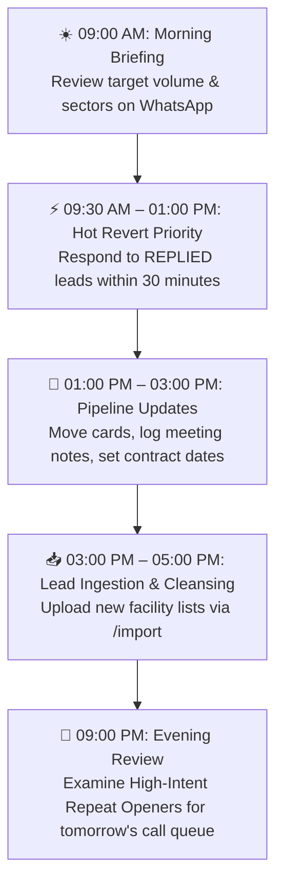

# 📋 VrindaaCorp Services — Staff Quick-Reference SOP & Pocket Guide
**Standard Operating Procedures (SOP) • Daily Execution Manual**  
*Target Audience: Sales Executives, Business Development Managers & Operations Staff*  
*System: VrindaaCorp Enterprise CRM & Autonomous Outreach Infrastructure*  
*Version: 1.0 (Production Release) • Handover Date: September 2026*

---

## 1. Daily Routine SOP (The 5-Step Daily Sales Rhythm)

Follow this operational rhythm to ensure maximum conversion on outbound campaigns:



### Time Allocation Breakdown:
1. **09:00 AM – 09:30 AM (Morning Game Plan):**
   - Check the automated WhatsApp brief sent to the management group.
   - Review the CRM Dashboard (`https://vrindaacorp-crm.tech`) to verify today's dispatch quota.
2. **09:30 AM – 01:00 PM (Hot Revert Fast Action):**
   - Filter the Leads table by `Stage: REPLIED` and `Hot: true`.
   - Call or reply to all new prospect inquiries. Target: **< 30-minute first response time**.
3. **01:00 PM – 03:00 PM (Pipeline Progression):**
   - Open `/pipeline` (Kanban Board).
   - Move progressed leads to `QUALIFIED` or `PROPOSAL_SENT`.
   - Update contract intelligence fields (incumbent vendor, contract expiry date).
4. **03:00 PM – 05:00 PM (List Uploads & Quality Review):**
   - Upload new prospect spreadsheets via `/import`.
   - Verify that all newly enrolled contacts display 🟢 `VALID` status badges.
5. **09:00 PM (Night Briefing & Queue Planning):**
   - Check the 09:00 PM WhatsApp Day-End report.
   - Note down prospects marked as **`High-Intent Repeat Openers (3x or 4x)`** for priority phone calls the next morning.

---

## 2. Inbound Reply SOP: Responding to Hot Reverts

When a prospect replies to an outreach email, the system automatically pauses their cold sequence, updates their stage to **`REPLIED`**, and triggers an alert.

```
┌────────────────────────────────────────────────────────┐
│  🔔 INBOUND REVERT DETECTED (sales@vrindaacorp.com)   │
│                                                        │
│  Prospect: Rajesh Sharma (Facilities Director)        │
│  Company: Apex Tower Commercial Park, Gurgaon         │
│  Message: "We are reviewing our housekeeping contract. │
│           Can you share commercial pricing for 50k sqf?"│
└──────────────────────────┬─────────────────────────────┘
                           │
                           ▼
┌────────────────────────────────────────────────────────┐
│             Ollama AI Draft Generated                  │
│                                                        │
│  "Hi Rajesh, thank you for reaching out. We would be   │
│   delighted to conduct a complimentary site audit of   │
│   Apex Tower. Feel free to book a convenient 30-min    │
│   discussion on our calendar:                          │
│   https://calendly.com/vrindaacorp-sales/30min..."     │
└──────────────────────────┬─────────────────────────────┘
                           │
             ┌─────────────┴─────────────┐
             ▼                           ▼
    [ Reply "YES" ]             [ Reply Instructions ]
   Sends instantly to          Ollama regenerates draft
   prospect mailbox.           and seeks re-approval.
```

### Action Steps:
1. **Option A (Via WhatsApp):**
   - Read the incoming alert on your mobile phone.
   - If the proposed reply is accurate, reply **`"YES"`** or **`"SEND"`**.
   - If you want adjustments, text your feedback directly (e.g., *"Add our PSARA certificate and schedule for Thursday 2 PM"*).
2. **Option B (Via CRM Lead Profile):**
   - Open `/leads/[id]`.
   - Read the client's email in the Activity timeline.
   - Click **Compose Reply** or place a direct phone call to the contact.
   - **Mandatory Link Rule:** If inviting them to schedule a meeting, strictly use:
     ```text
     https://calendly.com/vrindaacorp-sales/30min
     ```
     Never use unauthorized links or informal placeholders.

---

## 3. Lead Import SOP: Preparing & Cleansing Spreadsheets

Follow this checklist before uploading any new lead lists to protect our domain deliverability:

### 3.1 Spreadsheet Preparation Checklist
- [x] **File Format:** `.xlsx` (Excel) or `.csv` (Comma Separated Values).
- [x] **Header Row:** The first row must contain clear column labels (e.g., `First Name`, `Company`, `Email`, `Phone`, `City`, `Sector`).
- [x] **Email Format:** Clean emails without trailing spaces, semicolons, or extra brackets.
- [x] **Phone Format:** Indian 10-digit mobile numbers (the CRM auto-adds `+91`).

### 3.2 Interpreting Validation Status Badges

| Status Badge | Can We Email Them? | Operational Action |
| :---: | :---: | :--- |
| 🟢 **`VALID (Corporate)`** | **YES (Primary Target)** | Enterprise domain verified via live DNS MX probe. Enroll in campaigns immediately. |
| 🔵 **`VALID (Webmail)`** | **YES** | Active Gmail/Yahoo address. Safe to send personalized introductory emails. |
| 🟡 **`RISKY`** | **CAUTION** | Role mailbox (`info@`, `admin@`, `sales@`). Prefer calling via phone rather than cold bulk emailing. |
| 🔴 **`INVALID`** | **NO (Blocked)** | Email does not exist or domain has no mail servers. Do not attempt to send. |
| ⚫ **`DISPOSABLE`** | **NO (Blocked)** | Temporary throwaway mailbox. Auto-suppressed by the system. |

---

## 4. Visual Pipeline SOP: Stage Movement Criteria

Maintain strict data integrity on the Kanban Board (`/pipeline`):

```
[ NEW ] ──▶ [ CONTACTED ] ──▶ [ REPLIED ] ──▶ [ QUALIFIED ] ──▶ [ PROPOSAL SENT ] ──▶ [ WON 🏆 ]
```

| Pipeline Stage | Exit Criteria / When to Advance Card |
| :--- | :--- |
| **1. NEW** | Lead imported or captured from website. Unreached. |
| **2. CONTACTED** | Automated outreach email has been sent. *(Automated by system)*. |
| **3. REPLIED** | Prospect responded via email, WhatsApp, or phone. *(Automated by system)*. |
| **4. QUALIFIED** | Sales executive completed a discovery call and confirmed: (1) Facility size > 10,000 sq ft, (2) Active budget, (3) Key decision maker identified. |
| **5. PROPOSAL_SENT** | Formal commercial quotation, staffing estimate, or cafeteria tasting session proposal submitted. |
| **6. WON (Deal Closed)** | Service agreement signed, work order issued, or security deployment initiated. |
| **7. LOST** | Deal discontinued. **Mandatory Note:** Must add note explaining reason (e.g., *"Budget mismatch"*, *"Existing contract renewed for 1 year"*). |

---

## 5. Contract Intelligence SOP: Tracking Competitors

VrindaaCorp's competitive advantage lies in knowing when a prospect's incumbent contract is coming up for renewal:

1. Open the prospect's lead card (`/leads/[id]`).
2. Locate the **Contract Intelligence** section on the right side.
3. Fill in the verified details:
   - **Incumbent Vendor:** Current facility/catering company (e.g., *SIS, Updater Services, Sodexo, Compass, Local Vendor*).
   - **Contract Expiration Date:** Select the month and year the current contract terminates.
   - **Contract Status:** Set to `ACTIVE`.
4. Click **Save Intelligence**.
5. **Automated Renewal Trigger:** Exactly **30 days prior** to the expiration date, the CRM worker will automatically flag the lead and alert the sales team to present an aggressive switchover proposal.

---

## 6. WhatsApp AI Co-Pilot Command Cheat Sheet

You can send plain-English messages to the CRM agent via WhatsApp. Here are the fastest shortcut commands:

| Command / Message | What the AI Agent Does |
| :--- | :--- |
| `STATUS` or `METRICS` | Returns live today's stats: emails sent, unique open rate, replies, remaining daily quota. |
| `HOT` or `SHOW HOT LEADS` | Lists all warm prospects who recently replied and require immediate sales action. |
| `WHO OPENED` | Lists all leads who opened outreach emails today, highlighting repeat openers (2x, 3x, 4x). |
| `LOOKUP [Company Name]` | Returns contact details, phone number, current pipeline stage, and notes for that company. |
| `PAUSE` | Immediately halts all outgoing automated email campaign sending. |
| `RESUME` | Resumes automated campaign sequence dispatching. |
| `YES` or `SEND` | Approves and dispatches the most recently generated AI reply draft to the client. |
| `REVISE [Your feedback]` | Updates the proposed reply draft with your custom instructions and seeks re-approval. |
| `ADD LEAD [Name, Email, Org, City]` | Automatically creates a new validated lead record in the CRM database. |

---

## 7. Escalation & Support Matrix

If you encounter technical issues, follow this escalation protocol:

```
┌─────────────────────────────────┐
│       Tier 1: Sales Admin       │  Password resets, lead re-assignment,
│   (admin@vrindaacorp.com)       │  template edits, campaign pauses.
└────────────────┬────────────────┘
                 │ Unresolved Issue
                 ▼
┌─────────────────────────────────┐
│     Tier 2: Technical Support   │  IMAP mailbox disconnection, server errors,
│     (30-Day Engineering SLA)    │  WhatsApp QR unlinking, database issues.
└─────────────────────────────────┘
```

- **Sev-1 (System Down / Outreach Halted):** Call Engineering Support immediately (Target: < 2h response).
- **Sev-2 (WhatsApp or IMAP Issue):** Report to Admin via internal support channel (Target: < 4h response).
- **Sev-3 (General Question / Template Update):** Log ticket or email `admin@vrindaacorp.com`.

---
*End of Staff Quick-Reference SOP & Pocket Guide.*
